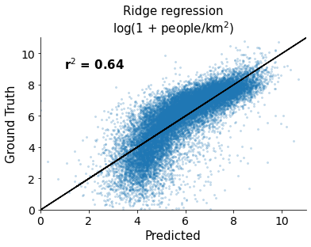
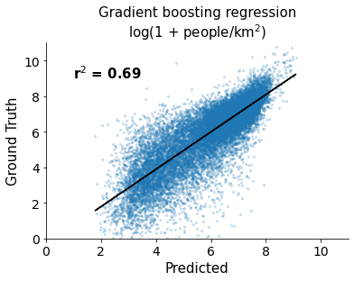

# mosaiks-api

The Multi-task Observation using Satellite Imagery & Kitchen Sinks (**MOSAIKS**) method was proposed by Rolf et al. in ["A generalizable and accessible approach to machine learning with global satellite imagery"](https://www.nature.com/articles/s41467-021-24638-z) as a way to "enable any user with basic resources to predict ground conditions using only satellite imagery and a limited sample of task-specific ground truth data which they possess". This method involves computing a fixed length feature representation for a given patch of satellite imagery, then using those features in a ridge regression model. The features are computed by a CNN that contains a single convolutional layer with a ReLU activateion followed by a global average pooling layer. The filters in the convolutional layer can be instantiated with patches sampled from the same imagery source, or randomly from the normal distribution. The authors apply MOSAIKS to iamgery from Google Maps and find that the resulting features are highly predictive in a variety of tasks, e.g.: estimating population density, elevation, forest cover, average income, ... (see [Fig 2.](https://www.nature.com/articles/s41467-021-24638-z/figures/2)).

In this repository we implement an API that will compute MOSAIKS features over NAIP aerial imagery, or Sentinel 2 satellite imagery given a query (latitude, longitude) point. This enables users that have datasets with geospatial points and corresponding labels to quickly generate corresponding satellite imagery based feature representations to assist in modeling tasks.

<p align="center">
    <br/>
    <b>Figure 1. </b>Results of estimating population of 1km^2 patches in the USA using a ridge regression and gradient boosting regression model with MOSAIKS features.
</p>


## Setup

```
conda config --set channel_priority strict
conda env create --file environment.yml
conda activate mosaiks

# verify that the PyTorch can use the GPU
python -c "import torch; print(torch.cuda.is_available())"
```


## Running the server

```
conda activate mosaiks
python server.py --port 8080
```


## API

The `server.py` script exposes an HTTP server that responds to POST requests.

There are two types of endpoints: **single** endpoints that take a single (_lat_, _lon_) point as input, and **batched** endpoints that take a list of (_lat_, _lon_) points as input.
More specifically, **single** endpoints expect JSON arguments in the form:
```
{
    "latitude": latitude,
    "longitude": longitude
}
```

while **batched** endpoints expect JSON arguments in the format:
```
{
    "latitudes": [latitude_0, ..., latitude_n],
    "longitudes": [longitude_0, ..., longitude_n]
}
```

Both types of endpoints return the same JSON input object with an additional `features` key.
In the **single** type, this is a list of size _1024_ containing a feature representation computed by RCF.
In the **batched** type, this is a nested list of size (_n_, _1024_) containing a feature representation computed by RCF for each point.


Currently there are three total endpoints:
- `/featurizeNAIPSingle`
- `/featurizeSentinel2Single`
- `/featurizeNAIPBatched`


### Examples

See examples of how to query the API at `notebooks/Demo notebook.ipynb`.


## Data

The CSV files in `data/` were downloaded from the [MOSAIKS Code Ocean capsule](https://codeocean.com/capsule/6456296/tree/v2) from `data/int/applications/*/`.


## To-dos

- [ ] The NAIP endpoints should use the STAC API from the planetary computer
    - [ ] The endpoints should all take time dimensions
- [ ] The endpoints should all take buffer size as a parameter and we should double check the units
- [ ] Logging needs to happen in a way that makes sense
- [ ] Models should be instantiated with a seed parameter such that results are reproducible
- [ ] There should be a model that takes 4 channel inputs and model that takes 3 channel inputs
- [ ] What happens if two requests come in and both want to use the model at the same time?
- [ ] Example of how to set a planetary computer subscription key
- [ ] Factor out the data loading into an interface similar to https://github.com/microsoft/temporal-cluster-matching/blob/main/temporal_cluster_matching/DataInterface.py
